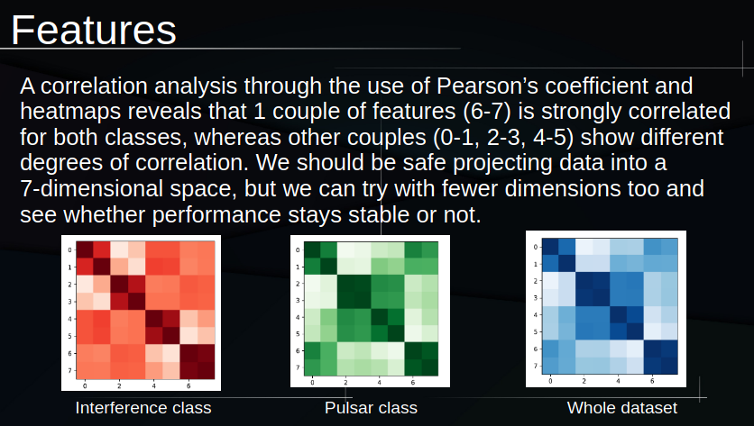

# Pulsar detection through machine learning algorithms

Machine learning for automatic detection of true pulsars from radio frequency interference, written from scratch without ML libraries. Trained on the HTRU2 dataset.

